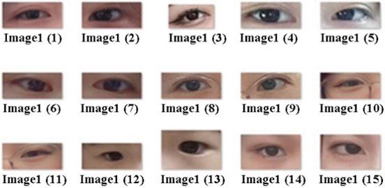
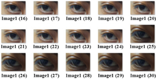
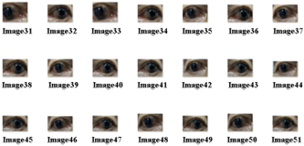
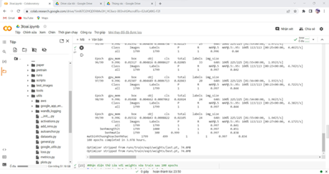
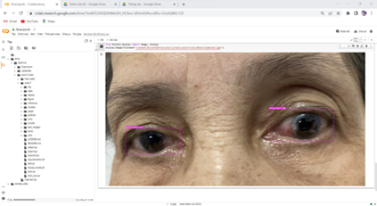
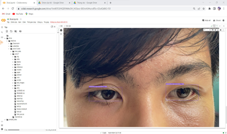
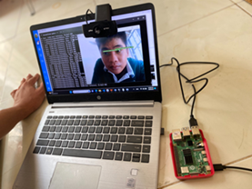
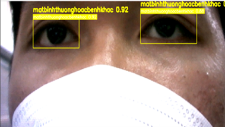
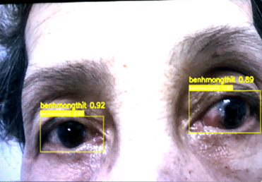
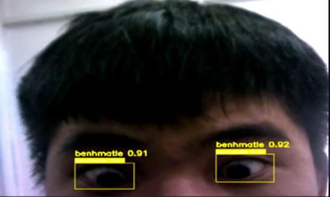

# About the Project
This project aims to develop an intelligent system capable of automatically identifying and diagnosing common eye diseases using deep learning. The system is designed to assist in early detection of eye conditions such as pterygium and strabismus (crossed eyes) by analyzing real-time images captured from webcams or cameras. We constructed a custom dataset with over 2,000 labeled images (including healthy, cross-eye, and pterygium cases) sourced from hospitals and real-world scenarios. Images were annotated using the Mask Sense labeling tool and trained using YOLOv7 on Google Colab. The final model is deployed on a Raspberry Pi 4 with a Dahua Z2 Plus 1080p webcam for real-time inference. This project not only demonstrates the feasibility of applying deep learning in the field of ophthalmology but also provides a low-cost, portable solution for communities lacking access to advanced medical facilities.
# Dataset

    

    

    

# Training on Google Colab

    

    

    

    

# Hardware

    

# Results

    

    

    

# Presentation at ICCSS - SSPS conference

    

    

    

    

